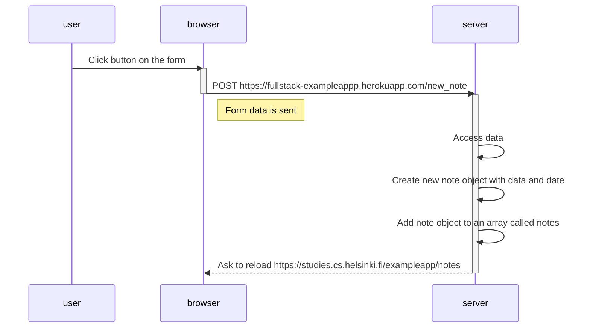

```mermaid
sequenceDiagram
    participant user
    participant browser
    participant server

    user->>browser: Click button on the form
    activate browser
    browser->>server: POST https://fullstack-exampleappp.herokuapp.com/new_note
    deactivate browser
    activate server
    Note right of browser: Form data is sent
    server->>server: Access data
    server->>server: Create new note object with data and date
    server->>server: Add note object to an array called notes 

    server-->>browser: Ask to reload https://studies.cs.helsinki.fi/exampleapp/notes
    deactivate server
    activate browser

```
