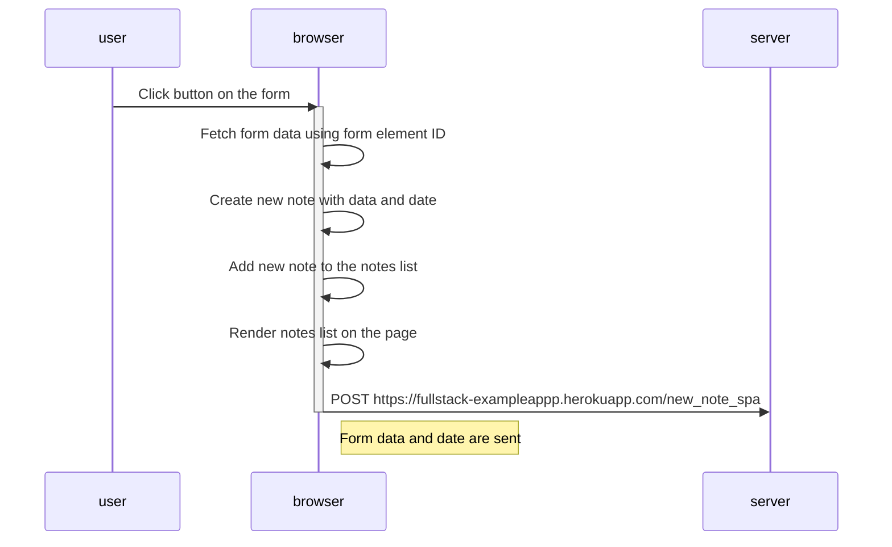

```mermaid
sequenceDiagram
    participant user
    participant browser
    participant server

    user->>browser: Click button on the form
    activate browser
    browser->>browser: Fetch form data using form element ID
    browser->>browser: Create new note with data and date
    browser->>browser: Add new note to the notes list
    browser->>browser: Render notes list on the page
    browser->>server: POST https://fullstack-exampleappp.herokuapp.com/new_note_spa
    deactivate browser
    activate server
    Note right of browser: Form data and date are sent

```
